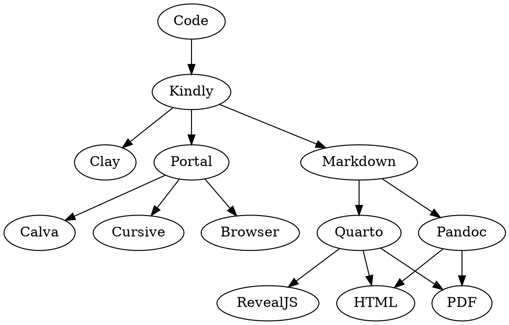

# claykind


A tiny library to produce [Kindly](https://scicloj.github.io/kindly/) expressions from Clojure source code.
This library is intended for use by literate programming tools such as [Clay](https://github.com/scicloj/clay) which produce documents from code.

```
Code -> Kindly-spec (what to display)
```

```clojure
[{:kind :kind/table
  :value {:column-names ... :row-maps}}
 {:kind :kind/vega-lite
  :value {...}}]
```



## Rationale

A glue library can be made use of in more contexts.
The Kindly specs can be used for the creation of markdown, tests, or other purposes.

## Status

Alpha. Subject to change.

## Usage

[](https://clojars.org/org.scicloj/read-kindly)

## License

Copyright © 2023 Scicloj

This program and the accompanying materials are made available under the
terms of the Eclipse Public License 2.0 which is available at
http://www.eclipse.org/legal/epl-2.0.

This Source Code may also be made available under the following Secondary
Licenses when the conditions for such availability set forth in the Eclipse
Public License, v. 2.0 are satisfied: GNU General Public License as published by
the Free Software Foundation, either version 2 of the License, or (at your
option) any later version, with the GNU Classpath Exception which is available
at https://www.gnu.org/software/classpath/license.html.
