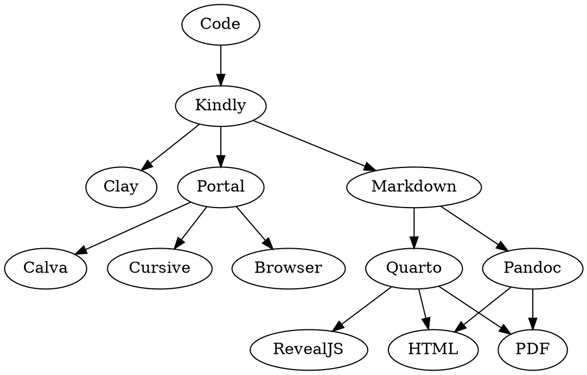

# Claykind


A proof of concept tying several potential parts together.

read-kinds (or note-kinds)

A tiny library to produce [Kindly](https://scicloj.github.io/kindly/) advice from notebooks expressed as Clojure namespaces.
Kindly advice informs visualization tools how to display code and values.
This library is intended for use by literate programming tools
such as [Clay](https://github.com/scicloj/clay) which produce documents from code.

```
Clojure namespace -> Kindly advice (what to display)
```

## Status

Pre alpha. Subject to change.

## Usage

[](https://clojars.org/org.scicloj/read-kindly)

No releases are provided yet.
Please add Claykind as a [git dependency](https://clojure.org/news/2018/01/05/git-deps) to your project if you would like to try it out.

Claykind can be invoked from the commandline (see `scicloj.claykind.main/-main`)
or the REPL (see `scicloj.claykind.api/render!`).

### Command line

```sh
clojure -M:dev -m scicloj.claykind.main --help

Claykind
 Version:  0.1.62-alpha
 Description: Claykind evaluates Clojure namespaces into Markdown
 Options:
  -f, --formats FORMATS
  -p, --paths PATHS
  -t, --target-dir DIR
      --evaluator [:clojure|:babashka]
      --verbose
      --quiet
  -h, --help
  -v, --version
```


### REPL

```clojure
(require '[scicloj.claykind.api :as claykind])

;; render the entire project
(claykind/render!)

;; render the current file being edited
(claykind/render! "notebooks/test/basic.clj" {:verbose true})
```

### Options

Options can be supplied by a file `claykind.edn` in the root of your project,
passed from the commandline, or passed as an argument when calling `clay/render`.
Options are the result of merging the defaults, config file, and arguments.
See `scicloj.claykind.main/cli-options` for an overview of options available.

By default, Claykind will look for source files in a `notebooks` directory (`:paths ["notebooks"]`),
and produce output to a `docs` directory (`:target-dir "docs"`).
See `scicloj.claykind.api/default-options` for a full list of default options.

### Front matter

Markdown front-matter is useful when using publishing tools like Quarto.
Front-matter will be taken from the metadata of the first form in the notebook.

## Examples

| Source                                           | Compiled                                  |
|--------------------------------------------------|-------------------------------------------|
| [notebooks](./notebooks)                         | [docs](./docs)                            |
| [babashka-example-book](./babashka-example-book) | [_book](./babashka-example-book/_book/)   |
| [how-to-code-a-book](./how-to-code-a-book)       | [_book](./how-to-code-a-book_book/_book/) |

## Rational

A glue library can be made use of in more contexts.
The Kindly specs can be used for the creation of markdown, tests, or other purposes.

Clay does quite a lot of things, and has undesirable dependencies.
We want to attempt to build something even simpler.
Something that emphasizes the evaluation and preparation.
Leaving downstream tools to perform rendering and display or test for changes.

Focusing on generating Markdown gives users more flexibility in selecting complementary publishing tools.

## Design

The key design focus is on creating interoperable parts,
and thus the key concern is what shape should the data be?

### Everything, all at once

Taking a broader view, we want all these parts to come together to achieve several outcomes:

* Process forms, namespaces, and directory trees of namespaces.
* Display inside an editor, render to HTML, or generate testable difference detection

Many of these parts already exist and have existing protocols that we should adapt to.

A complete pipeline of tool composition might look something like this:

```
my-ns.clj
 -> AST
  -> top level forms
   -> eval
    -> kind inference
     -> kind validation/parsing
      -> downstream tools (editors/html/tests)
```

Throughout the pipeline will pass various representations,
beginning with a string (the original representation of the code),
which is read into an Abstract Syntax Tree,
which is converted into forms for evaluation.

Let's examine the stages of the pipeline.

#### rewrite-clj keeps whitespace

The first stage converts from the text representation of the code into a data-structure.
The shape of this data-structure will remain largely unchanged from here,
being annotated with more information by other stages.

```clojure
[{:code "(...)"
  :form (...)}
 {:code "(...)"
  :form (...)}]
```

You can imagine the above representing all the top-level forms in a namespace.

#### Evaluation attaches a value

```clojure
[{:code  "(...)"
  :form  (...)
  :value {:column-names ... :row-maps ...}}
 {:code  "(...)"
  :form  (...)
  :value {...}}]
```

#### Kind inference attaches display hints

```clojure
[{:form  (...)
  :code  "(...)"
  :value {:column-names ... :row-maps}
  :kind  :kind/table}
 {:code  "(...)"
  :form  ()
  :value {...}
  :kind  :kind/vega-lite}]
```

* While it sounds desirable to automatically detect the kind always, bear in mind that metadata hinting the kind is
  desirable so that when there is an error, it can be reported.
* WARNING: Kinds can be nested! example: `^:kind/table {:rows [^:kind/table {:rows [1 2]]}` so having a `:value` and
  a `:kind` is insufficient. Either the value should be replaced with a metadata annotated value, or the kind should be
  a richer version of the value in some other way. On the other hand, the top level kind may still have some use.

#### Kind validation (and parsing)

```clojure
[{:form   (...)
  :code   "(...)"
  :value  {:column-names ... :row-maps}
  :kind   :kind/table
  :valid  true
  :parsed {...}}
 {:code   "(...)"
  :form   ()
  :value  {...}
  :kindly :kind/vega-lite
  :valid  false
  :exception  {:message "Bad"
               :line    34}}]
```

### The role of Kindly

Tools benefit from having a standard way of passing information about things to display.
We have already seen what that looks like.
Kindly defines the tool passing shape (which end users don't need to know about),
and it also defines the user facing grammar of what things can be displayed.
End users experience Kindly as a schema for creating data structures that can be visualized.

Kindly abstracts inference.
Kindly abstracts rendering.
Imagine a blog post without any tool specific annotations,
that can generate Markdown, HTML, and be viewed in an IDE.

There is a short list of Kindly grammars:

* hiccup
* tables
* plain data structures
* plots
* images
* reagent component
* tablecloth datasets
* markdown

End users have several options for informing tools which grammar they intend to use:

1. Inference: does the data look like one of these?
2. Explicitly marking a `kind` via metadata
3. Using Kindly functions to mark `kind` via metadata.

### The importance of Kindly plugins

Advice in itself may not be enough for the visualization tool to work with,
as it may not be designed with Kindly in mind.
In such cases, plugins exist to translate grammars.
See kind-portal as an example.

### Composition

There are many tools that compose this way:



This library concerns itself only with constructing the initial data representation of the code and pairing it with
values from evaluation.

A big challenge in achieving the composition we seek is establishing standards to abide by for tool creators.
Perhaps we can draw inspiration from HTML strategies.

* Unknown tags render the content of the tags
* noscript handles situations where functionality is missing
* css allows fallback tags (if you can't render this kind, then try that kind)
* anomalies library is interesting for error categorization
* ring was enough and won
* adapter to portal
* portal is not only a tool, it is a specification (could be a kind)
* notebook writers may wish to configure which viewer to render with

### Code layout

Adapters take a context and produce a representation,
for example hiccup, markdown, or portal-annotated values.

Builders make pages.

Claykind creates an interface for rendering notebooks to markdown via commandline and code or REPL.

Read-kinds evaluates notebooks into a sequence of contexts.

## TODO

* Better Markdown
* Kindly grammars


## License

Copyright © 2023 Scicloj

This program and the accompanying materials are made available under the
terms of the Eclipse Public License 2.0 which is available at
http://www.eclipse.org/legal/epl-2.0.

This Source Code may also be made available under the following Secondary
Licenses when the conditions for such availability set forth in the Eclipse
Public License, v. 2.0 are satisfied: GNU General Public License as published by
the Free Software Foundation, either version 2 of the License, or (at your
option) any later version, with the GNU Classpath Exception which is available
at https://www.gnu.org/software/classpath/license.html.
